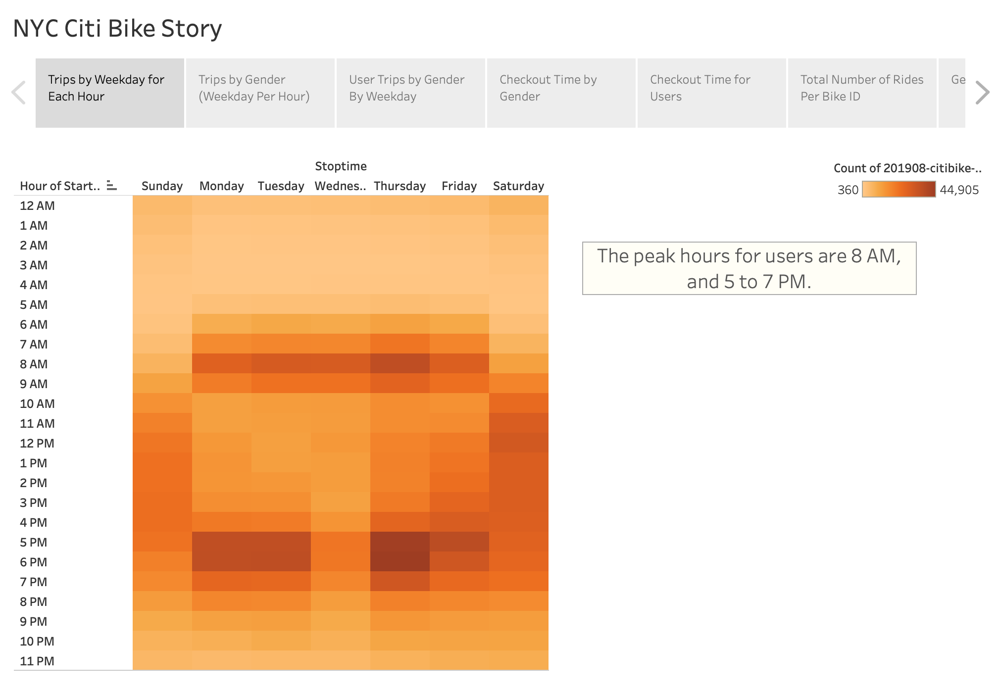
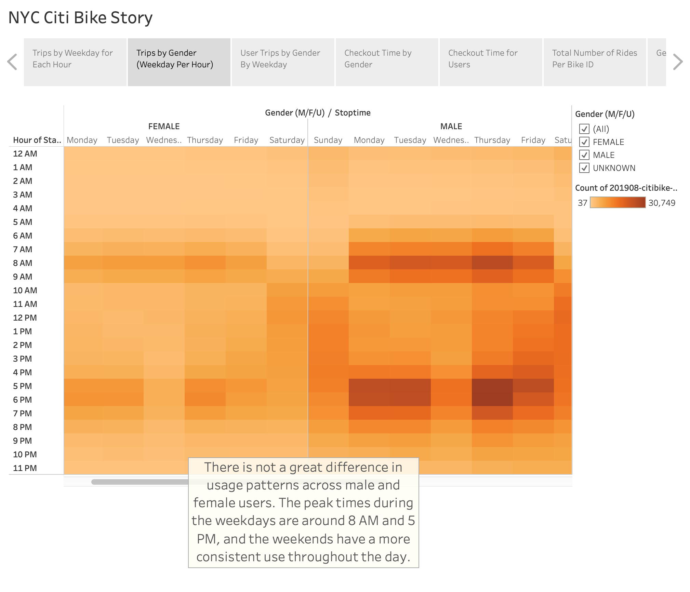
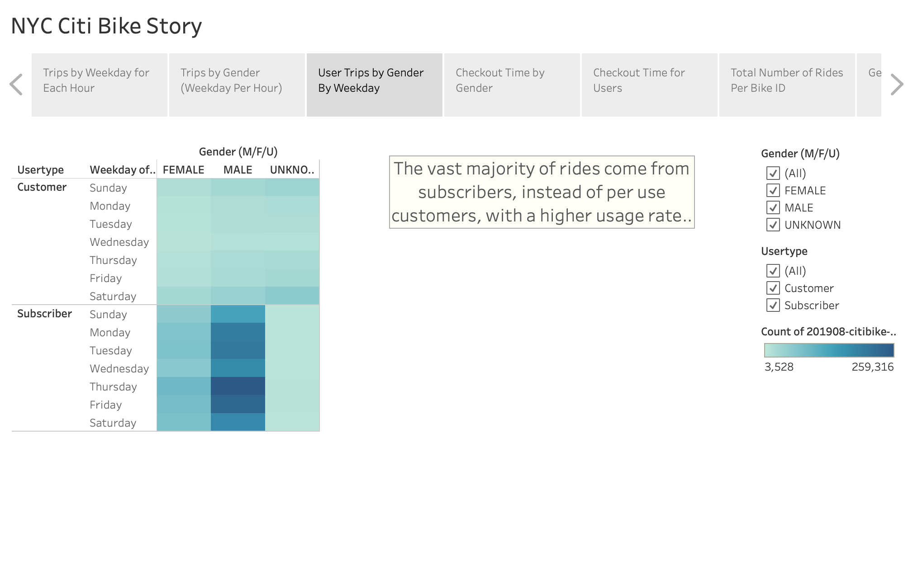
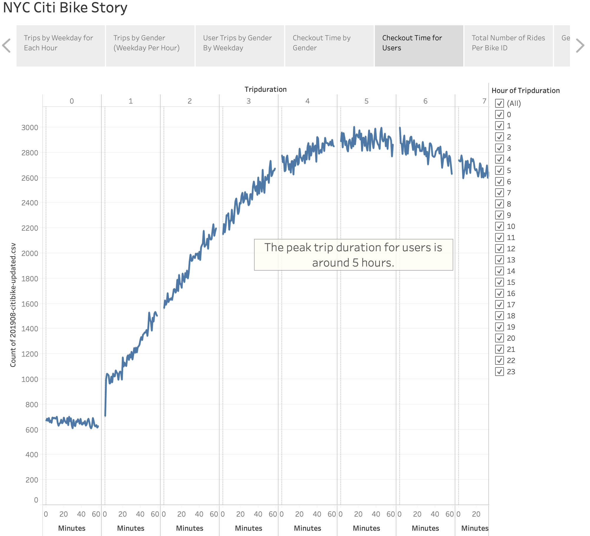
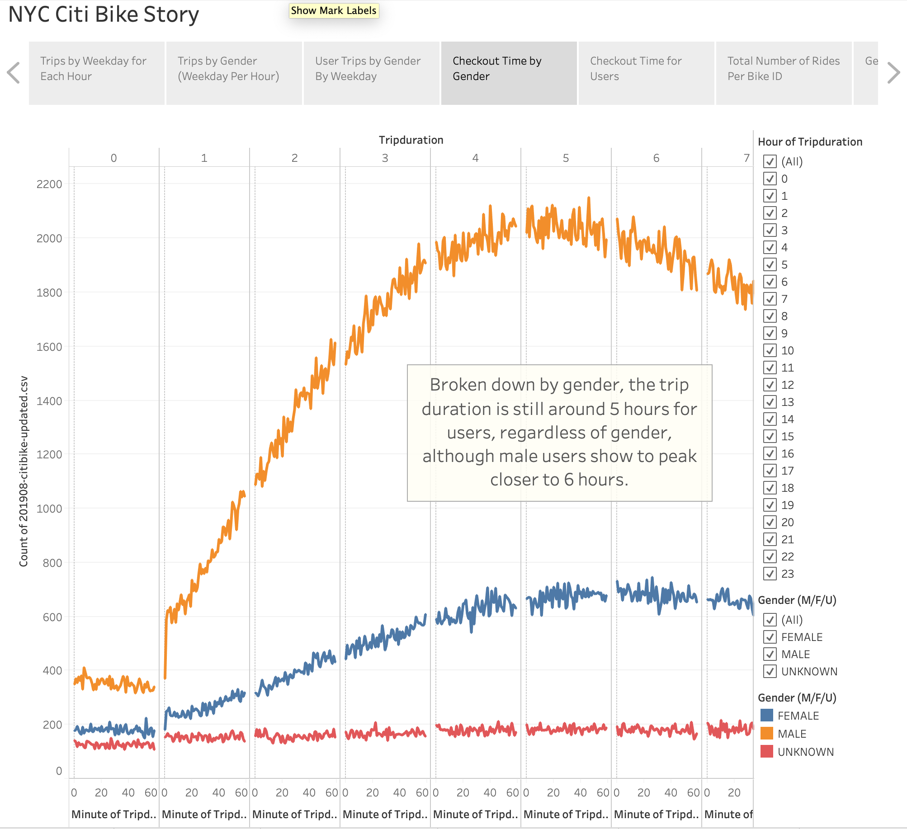
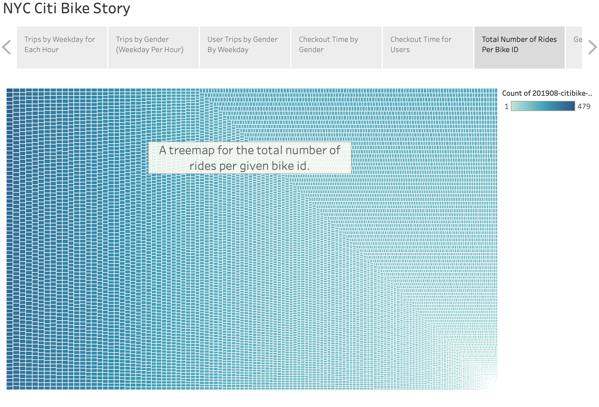

# Bike Sharing

## Overview

We have been assigned to analyze New York's Citi Bike users and usage for a pair of entrepreneurs who want to start a bike sharing company in Des Moines, Iowa. 

Our insights from this data will be visualized in Tableau.

## Results

[link to dashboard](https://public.tableau.com/profile/ian7021#!/vizhome/Module14Challenge_16044471346990/NYCCitiBikeStory?publish=yes)

Trips By Weekday Per Hour

It is evident from our visualization that there are very high usage rates on the weekdays from 8 AM to 9 AM and 5 PM to 7 PM, indicating that it is heavily utilized for work commuting. However, the weekend has pretty steady usage over the course of the day.

Trips By Gender (Weekday Per Hour)

Now with a breakdown of this information by user gender, the same trends are evident. There is higher usage during commuting hours on weekdays, but steady usage on weekends.

User Trips By Gender By Weekday

Here, we have broken down the user types, per use customers and subscribers, which is then further categorized by gender. The per use customers appear to have lower usage rates on the weekdays, while there is higher activity on the weekends. Conversely, the subscribers are far more consistently active on the weekdays, and there are more rides by male users.

Checkout Time for Users

This graph breaks down the trip durations by the number of rides, and it is clear that the majority of users have about 5 to 6 hour long trips.

Checkout Time By Gender

This graph seeks to further break down the trip duration, again through the gender of users. However, the trends seem to be similar as the total users, as both male and female users still have 5 or 6 hour trips.

Total Number of Rides Per Bike ID

This chart conveys the number of rides per bike ID, and thus it can provide insight on the possible maintenance costs for the company as the usage that the bikes have increases.

## Summary

From these visualizations, we can start to make suggestions to our client before they start their bike sharing business. First, there should be a heavy focus on marketing toward gaining subscribers to the system, as the vast majority of rides come from the subscriber base. Additionally, there is consistent and heavy usage of weekday usage for work commutes, and therefore, there should be investment specifically in placing bike racks aimed toward commuter convenience. Lastly, given the usage on the weekends by non subscribers, there could be a subscriber plan toward less active users, or only weekend users.

In addition to our visualizations, there could be further analysis done to better understand current users of NYC Citi Bike before starting this company in Des Moines. We could create a chart to uncover more information about the demographics of users, specifically the age ranges of users and the distribution of them. Another data point and visualization that could be useful is mileage per trip.

